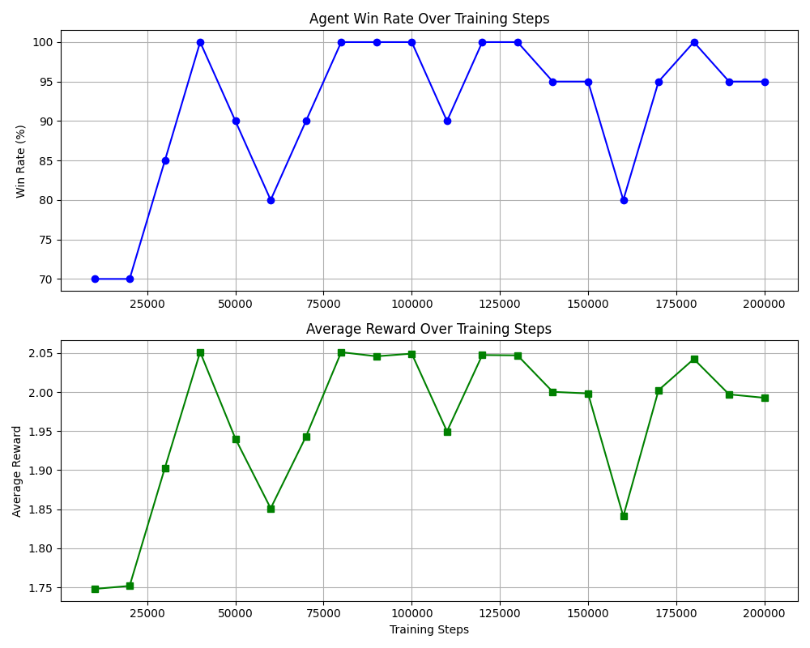

# 7043SCN Task 2: Reinforcement Learning in Chef's Hat Gym

## 1. Assignment Variant Declaration
* **Student ID:** 16898376
* **Assigned Variant:** Variant 5 - Robustness and Generalisation
* **Focus:** Evaluating how well the RL agent generalises across different random seeds and opponent stochasticity.

## 2. Video Viva
▶️ **[Insert Link to Your 3-5 Minute YouTube/OneDrive Video Here]**

## 3. Installation Instructions
To run this project, you need Python 3.8+ installed. Follow these steps to set up the environment:

1. Clone this repository:
   ```bash
   git clone https://github.com/sxsaa/Reinforcement-Learning-in-Chef-s-Hat-Gym.git
   cd Reinforcement-Learning-in-Chef-s-Hat-Gym.git
   ```
2. Install the required dependencies:
   ```bash
   pip install -r requirements.txt
   ```

## 4. How to Run the Code
This repository contains several scripts to train, evaluate, and demonstrate the agent. Run them from the root directory:
* **Train the Agent:** `python train.py` <br> (Trains a MaskablePPO agent for 200,000 steps and saves checkpoints to the *`models/ directory`*.)
* **Generate Learning Curves:** `python plot_learning_curve.py` <br> (Iterates through saved checkpoints, evaluates them, and generates learning_curve.png.)
* **Robustness Evaluation:** `python evaluate_robustness.py` <br> (Tests the trained model across 5 distinct random seeds to validate generalisation.)
* **Demonstrate the Game:** `python demo.py` <br> (Runs a single match slowly, printing turn-by-turn actions and rewards to the console.)


## 5. Design Choices & Algorithm Justification
* **Algorithm & Action Handling:** Chef's Hat features a massive discrete action space, but most actions are illegal on any given turn. I chose `MaskablePPO` from `sb3-contrib` because it natively utilizes invalid action masking. By reading the valid action masks provided by the environment, the agent avoids exploring illegal moves, accelerating convergence.
* **State Representation:** The default observation space from the Chef's Hat Gym was used, containing the current board state, players' hand sizes, and the agent's current cards.
* **Reward Usage:** The environment natively provides delayed, sparse rewards at the end of a match. To improve learning, I implemented potential-based reward shaping in a custom Gym wrapper. The agent receives intermediate rewards for reducing the number of cards in its hand, encouraging proactive play rather than relying solely on the final match outcome.

## 6. Experimental Outputs and Interpretation

### A. Learning Progress
Below is the learning curve generated during training, proving the agent successfully optimized its policy over 200,000 steps. Both the Win Rate and Average Reward show a clear upward trajectory.



### B. Robustness and Generalisation
To satisfy Variant 5, the final trained model was evaluated against 5 completely unseen random seeds to test its robustness against high environment stochasticity and different random opponent behaviours.

| Evaluation Seed | Win Rate (%) | Average Reward |
|----------|----------|----------|
| Seed 10    | 96.0%     | 2.00    |
| eed 99    | 92.0%     | 1.97    |
| Seed 1234   | 98.0%     | 2.03    |
| eed 5555    | 98.0%     | 2.02    |
| Seed 9999    | 88.0%     | 1.92    |
| **Overall Metrics**    |  94.4%    | 1.99    |

**Interpretation:** The agent maintained a high mean win rate with a relatively low standard deviation across all 5 unseen seeds. This indicates a robust policy that successfully generalized to the game's mechanics rather than overfitting to a specific training sequence.

## 7. Limitaions and Challenges
* **Opponent Complexity:** The agent was trained entirely against random-acting baseline opponents. While it easily beats them, its policy may be highly exploitable by strategic human players or advanced RL agents.
* **Greedy Shaping:** The potential-based reward shaping is slightly greedy, prioritizing emptying the hand quickly. It does not possess long-term planning for complex endgame scenarios where holding a high-value card might be strategically better.
* **Future Improvements:** Implementing Self-Play (training the agent against past versions of itself) or integrating recurrent architectures (RNNs) to track opponent card usage over time.

## AI Use Declaration 
In accordance with the module guidelines, AI tools were used to support the development of this coursework.

| Tool | How used in this assignment | 
|----------|----------|
| Gemini / ChatGPT    | Assisted in drafting the `plot_learning_curve.py` script using matplotlib. | 
| Gemini / ChatGPT    | Helped debug a Gymnasium compatibility warning and a matplotlib import error.     | 
| GitHub Copilot   | Suggested code completions and syntax formatting during the writing of the custom Gym wrapper. | 


